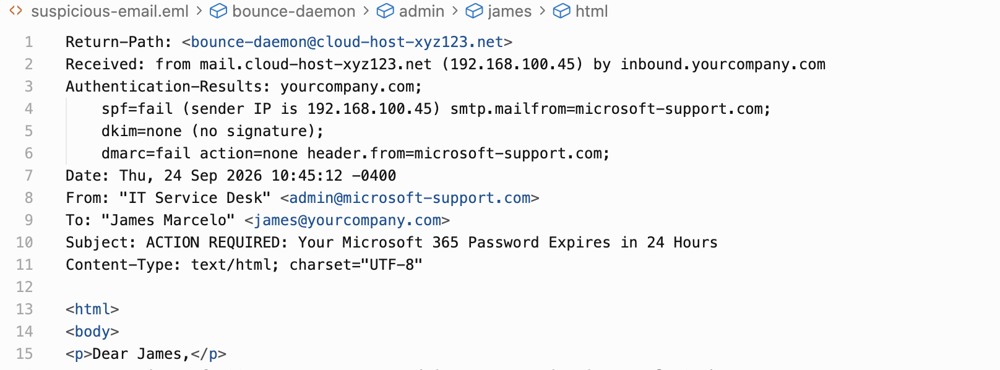
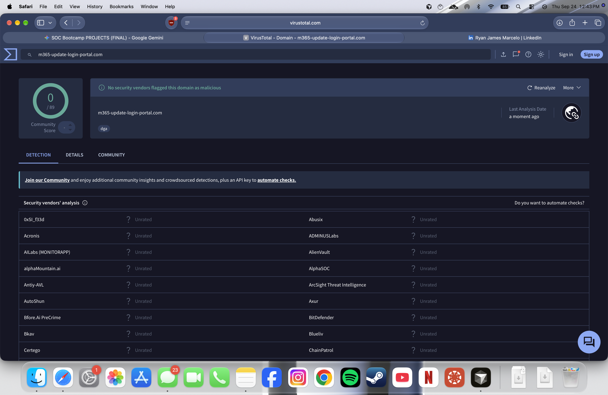
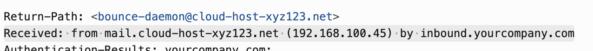

Phishing Investigation & OSINT Analysis

## Objective
Triage a reported suspicious email, analyze email headers for spoofing, extract and defang Indicators of Compromise (IOCs), and perform OSINT research to determine a true positive/false positive verdict.

---

## Phase 1 & 2: Header Analysis & Authentication
* **Observation:** A user reported an email claiming their Microsoft 365 password was expiring.
* **Analysis:** The email was analyzed in a text editor to prevent accidental payload execution.
  * **SPF:** `FAIL` - The sending IP (192.168.100.45) is not authorized to send mail on behalf of the spoofed domain.
  * **DKIM:** `NONE` - No cryptographic signature was present.
  * **DMARC:** `FAIL` - Authentication failed, indicating the email is spoofed.
  * **Header Mismatch:** The `Return-Path` (cloud-host-xyz123.net) did not match the `From` address.

---

## Phase 3: Payload Extraction & OSINT Profiling
* **Extracted Indicator:** Found a suspicious hyperlink embedded in the email body.
* **Defanged URL:** `hxxp://m365-update-login-portal[.]com/auth/login[.]php?user=james`
* **Infrastructure Analysis:** 
  * Traced the `Received:` headers to originating IP: `192.168.100.45`. Identified this as an RFC 1918 Class C private address, meaning it is non-routable on the public internet (lab environment).
  * Searched the extracted domain on VirusTotal.
* **OSINT Findings:** The domain returned a 0/89 detection score but was flagged with a `dga` (Domain Generation Algorithm) tag, which is highly characteristic of Newly Registered Domains (NRDs) used in credential harvesting campaigns before security vendors can blacklist them.

---

## Phase 4: Final Incident Report

**Incident Type:** Credential Harvesting / Phishing Attempt  
**Verdict:** True Positive  
**Malicious Indicator:** `hxxp://m365-update-login-portal[.]com`  
**Sender IP:** `192.168.100.45` (Internal/Private)  

**Executive Summary:**
A user reported a suspicious email claiming their Microsoft 365 password was expiring. Analysis of the email headers confirmed the sender was spoofing the Microsoft domain, as SPF and DMARC authentication checks failed. The embedded hyperlink directs users to a newly registered, unverified domain designed to steal login credentials. 

**Recommended Actions:**
1. **Block:** Add `m365-update-login-portal.com` to the corporate firewall and DNS web filter blocklists.
2. **Purge:** Perform an enterprise-wide message trace and purge this email from all other user inboxes.
3. **User Education:** Notify the reporting user that this was a confirmed phishing attempt and commend them for reporting it to the SOC.# phishing-investigation-osint-project
